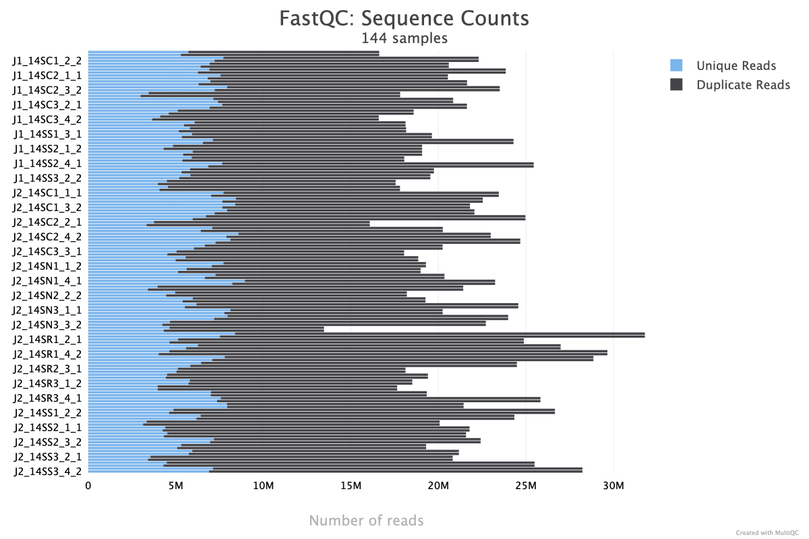
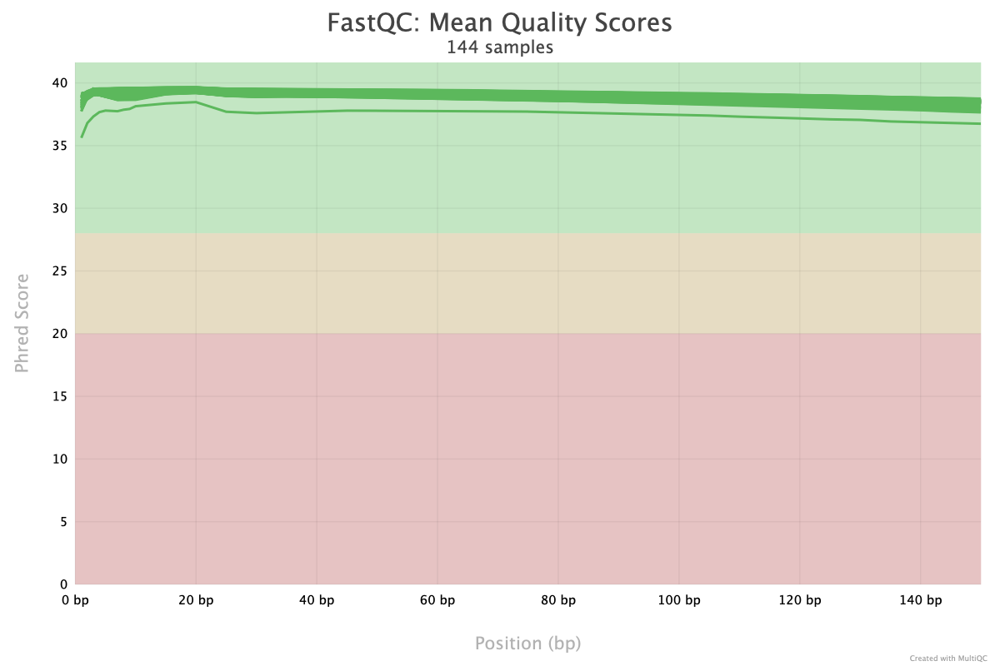
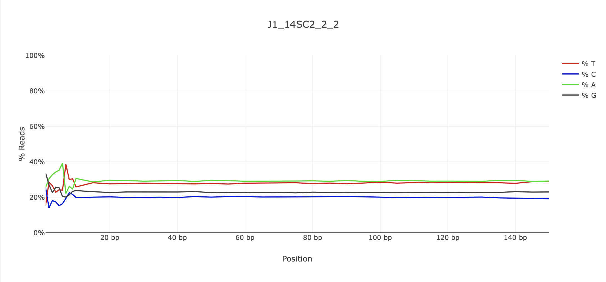

# Chapter 3 Juvenile CADO RNASeq Analysis
**Author: Megan Guidry**

All analysis was done on our lab shared server, KITT, made by [J. Puritz](https://github.com/jpuritz) in /home/mguidry/3_Juvenile-CADO/

Programs Installed/Needed for this Project:  
- HISAT2 
- StringTie 
- gffcompare 
- fastp, fastQC, multiqc
- samtools

File Naming and Information:

location of reference genome on KITT: `/RAID_STORAGE2/Shared_Data/Oyster_Genome/masked/masked.cvir.genome.fasta`

- `masked.cvir.genome.fasta`: Eastern Oyster genome
- `ref_C_virginica-3.0_top_level.gff3`: annotation file for the Eastern Oyster, I also got this from Erin, it has the matching header line convention to work with the above genome
- `prepDE.py`: python script for converting read count information from StringTie into a matrix fo DESeq2, full code [here](http://ccb.jhu.edu/software/stringtie/dl/prepDE.py)
- ``: this is an example of the naming convention of the samples


General notes: 

[**Easy Guide to tmux**](https://hamvocke.com/blog/a-quick-and-easy-guide-to-tmux/)
```
#create a new session and run desired command
tmux new -s my_session
your_command

#to detach from the session and have things run in the background
Ctrl + b, then d 
##or type
tmux detach

#list tmux sessions
tmux ls

#reattach to session
tmux attach -t my_session

#kill session (if needed)
tmux kill-session -t my_session
```


-------
## Steps:

1. Set up 
2. Raw read QC
3. Trimming with fastp
4. Trimmed read QC
5. Mapping/Aligning reads to genome (HISAT2)
6. Assemble mapped reads into transcripts (StringTie)
7. Prep files for differential expression analysis
8. Prepare metadata file (.csv)
9. DESeq2 and further analysis

________


## Before you begin...
Create conda environment & install packages
```{bash}
conda create -n Ch3 hisat2 star stringtie gffcompare fastp fastQC multiqc samtools
conda activate Ch3
```
`conda list` will allow you to look at all of the packages you have installed in your environment.


## 1. Set up
Reads were already de-multiplexed and assigned to each individual sample by Novogene. To get started, we'll first link the data to the current working directory. 
Should have 72 samples each with a F and R read (144 *.fq.gz* files).

Create symbolic link to fastq files in RAIDSTORAGE2
```
cd home/mguidry/3_Juvenile-CADO
mkdir raw_reads
cd raw_reads

#symlink reads from individual sample folders into raw_reads directory
for i in /RAID_STORAGE2/Raw_Data/ASMFC_RNA/usftp21.novogene.com/01.RawData/*; do
    ln -s "$i"/*.fq.gz .
done

#check number of files in directory 
ll *fq.gz | wc -l
```

### Check out read counts 

**Purpose:** Look at read counts across samples prior to trimming.

Look at the read counts for each file using a code from [this website](http://www.sixthresearcher.com/list-of-helpful-linux-commands-to-process-fastq-files-from-ngs-experiments/) made into a for-loop that went through all the files. It outputs the filename and the number of reads in that file. Takes 1-2mins/sample.

```
for fq in *.fq.gz
do
    echo "File: $fq"
    reads=$(zcat "$fq" | wc -l)
    echo "Reads: $((reads / 4))"
done > number_of_raw_reads.txt
```

## 2. Raw read quality check
**Purpose:** Establish a baseline of what the read quality looks like to help determine trimming parameters in the next step.

Checked out the quality of the reads in each .fq.gz file using MultiQC & FastQC. We'll go back and run the same on the trimmed data in the next couple of steps too. But first, we want to get an idea of what the data look like before trimming. *Took roughly 7-8hrs.*

```
cd /home/mguidry/3_Juvenile-CADO
mkdir fastqc_raw
fastqc -o /home/mguidry/3_Juvenile-CADO/fastqc_raw/ raw_reads/*fq.gz   #took about 8 hrs for these data 
cd raw_reads 
ll *.fastqc.zip | wc -l #check to make sure we have 144 files (2 per sample - fwd & rev)
cd ../fastqc
multiqc . #output a multiqc report
```

Tranferred `multiqc_report.html` file to computer and opened in web browser.

### Raw reads QC report

#### Raw FastQC: Sequence Counts 
Notes:
* lots of duplicate reads across all samples 
* 3.5-8M unique reads across samples



#### Raw FastQC: Raw sequence quality 
Mean quality value across each base position in the read. 

Notes:
* looks good overall 
* everything is between 35-40 across the board 
* J1_14_SC3_1_2 is the one read that is a little lower - not sure why, but it still has great quality scores across the read



#### Raw FastQC: Per Base Sequence Content 
The proportion of each base position for which each of the four normal DNA bases has been called.

Notes:
* little messy 1-10bp, but this is to be expected bc of the low diversity in the adapter sequence making it challenging to resolve colors
* fairly straight lines from 10bp on 
* plot below representative of most samples 



### NOTES on Raw QC report: 
- lots of read duplication - typical for oysters bc of repeats throughout the genome? and they are highly related? and expressing similar suites of genes?
- avg. GC content isn't really normally distrubuted, is this something to investigate?
- adapter content plot (adapter contamination?) - one sample looks funky (J1_14SC3_1_2)
- does anything in particular catch your attention that I'm missing?
- proceeding with trimming - game plan 

## 3. Trimming raw reads with [`fastp`](https://github.com/OpenGene/fastp)
**Purpose:** Cleaning up the raw reads to improve quality of sequences used in future analyses. 

**Features of fastp:**
1. filter out "bad" reads (too low quality, too short, or too many missing basecalls) - doesn't apply to these data?
2. cut low quality bases in each read 5'-3' determined by mean quality in a sliding window
3. cut adapters - automatically detected by fastp and enabled by default
4. trim reads at front and tail - if desired
5. correct mismatched bp in overlapped regions of paired end reads - if one base has quality and is paired with another over very low quality -- again, dont think this applies here bc high quality data
6. trim polyX tailing 
7. report JSON format results for futher interpreting
8. visualize QC and filtering results to html 

`fastp` flags:\
`-i` = input file, forward\
`-I` = input file, reverse\
`-o` = output file, forward\
`-O` = output file, reverse\


**Running `fastp`**
runtime: ~2.5 hrs

```{bash}
mkdir trimmed_reads

#loop through all files
for fq in *_1.fq.gz
do
    # get sample name (everything before "_1.fq.gz")
    sample=$(basename "$fq" _1.fq.gz)

    fastp -i ${sample}_1.fq.gz -I ${sample}_2.fq.gz -o ../trimmed_reads/${sample}_F.trim.fq.gz -O ../trimmed_reads/${sample}_R.trim.fq.gz -j ../trimmed_reads/${sample}.json -h ../trimmed_reads/${sample}.html
done

#one sample
#fastp -i sampleA.1.fq.gz -I sampleA.2.fq.gz -o trimmed_reads/sampleA.F.trim.fq.gz -O trimmed_reads/sampleA.R.trim.fq.gz  -f 9 -j trimmed_reads/sampleA.json -h trimmed_reads/sampleA.html
```  


## 4. Trimmed read quality check
**Purpose:** Check the cleaned up reads.\
runtime: 7-8hr?? (21:30-____)

```
cd /home/mguidry/3_Juvenile-CADO
mkdir fastqc_trimmed
fastqc -o /home/mguidry/3_Juvenile-CADO/fastqc_trimmed/ trimmed_reads/*fq.gz

cd fastqc_trimmed
ll *.fastqc.zip | wc -l #check to make sure we have 144 files (2 per sample - fwd & rev)
multiqc . #output a multiqc report
```

***Trimmed reads look good! The biggest change was in the Adapter content plot, as the adapter seqs were removed.***


## 5. Mapping/Aligning reads to *C. vriginica* genome with [HISAT2](https://daehwankimlab.github.io/hisat2/manual/)
**Purpose:** Matching up the sequenced reads with regions on the reference genome.   
Using HISAT2 had a decent % of reads aligned and decent transcriptome coverage (when compared to other aligners). STAR was the only exception however, HISAT2 runs faster [(Musich et al 2021).](https://www.frontiersin.org/journals/plant-science/articles/10.3389/fpls.2021.657240/full)

Location of genome: `/home/Genomic_Resources/C_virginica/reference.fasta`    

To align the trimmed reads to the genome, I used HISAT2. Bahrami 2020, found that HISAT2 resulted in the highest % of reads correctly mappeed when compared to TopHat2, STAR and Bowtie2. 

**Set up**    
```
# starting from /home/mguidry/3_Juvenile-CADO
mkdir mapping
cd mapping

# link to trimmed sequence files
ln -s /home/mguidry/3_Juvenile-CADO/trimmed_reads/*trim.fq.gz .
# link to c virginica genome
ln -s /home/Genomic_Resources/C_virginica/reference.fasta .
```

**Running HISAT2**     
Ran the following script `juve_cado_hisat2.sh` from the mapping directory, in tmux and within the conda env.

This script first makes an index using the reference genome then it aligns each trimmed fq.gz file to the genome using that index. You only need to make the index once. Next, hisat2 takes in the paired sequences and aligns them to the index and produces 1 SAM file. Next steps convert SAM to BAM then sort BAM. Finally the SAM file is deleted and the alignment info is stored in a folder called 'summaries'.

Runtime: __ hrs (11:45am on 10/7/25 -x:xx) - likely to take ~30+hrs
- index runtime was ~15mins

**`juve_cado_hisat2.sh`**
```
##!/bin/bash

#Specify working directory
F=/home/mguidry/3_Juvenile-CADO/mapping

#Indexing a reference genome and no annotation file (allowing for novel transcript discovery)
#Build HISAT index with Cvirginica genome file - once the index is built, you don't have to re-run this
hisat2-build -f $F/reference.fasta $F/cvirginica_hisat

#Aligning paired end reads
#Has the F in here because the sed in the for loop changes it to a R. 
#SAM files are of both forward and reverse reads (one SAM file for each pair of Fwd and Rev)
array1=($(ls $F/*F.trim.fq.gz))


#for each file in the array...
#aligns the given files (Fwd & Rev) to the index (previously generated) with the --dta flag indicating to report the alignments tailored for transcript assemblers
# important to specify that these data were prepped with a directional/stranded library prep approach meaning we have directionally of reads - this is indicated to hisat with the --rna-strandedness flag and PE reads are specified with "FR" 
#then outputs the alignment summary to a sample specific summary file
#next samtools view converts the sam to bam and samtools sort converts the bam to a sorted (smaller) bam file that stringtie will like
#finally we remove the sam file because it's really big and we dont need it anymore


for i in ${array1[@]}; do 
        hisat2 --dta -x $F/cvirginica_hisat -1 ${i} -2 $(echo ${i}|sed s/F.trim/R.trim/) --rna-strandness FR -S ${i}.sam 2>${i}.alignsummary.txt
        samtools view -bS ${i}.sam > ${i}.bam
        samtools sort ${i}.bam -o ${i}.s.bam
    		echo "${i}_bam"
        rm ${i}.sam
        echo "HISAT2 PE ${i}" $(date)
done

#move all of the summary files to their own directory
mv *.alignsummary.txt ./summaries
```

Sorted BAM files (*.s.bam) are then used with StringTie to generate annotation files with transcript abundances.   
Should be left with 72 .bam and 72 .s.bam files at the end of the alignment run.

Calculate mapping percentages and output to a file called 'mapped_read_counts'
```
for i in *.fq.gz.bam; do
    echo "${i}" >> mapped_read_counts
    samtools flagstat ${i} | grep "mapped (" >> mapped_read_counts
    done
```

Find the min, max, and average of the mapping percentages
```

```

Range of ________% alignment rate across samples. Alignment summaries stored in /mapping/summaries.


## 6. Assembly with [StringTie](https://ccb.jhu.edu/software/stringtie/index.shtml?t=manual)
**Purpose:** Assemble the mapped reads with StringTie's network flow algorithm from multiple splice variants at a gene locus into probable transcripts. From there, transcript expression abundance can be quantified and analyzed.  

Performing a reference-guided assembly of the mapped reads following StringTie's recommended workflow which includes the `-e` flag allowing for novel transcript discovery.    


Steps for StringTie analysis:
1. For each RNAseq sample, run StringTie to assemble the read alignments obtained from HISTAT2 mapping step. Recommended to run StringTie with the `-G` option if reference annotation file is available.    
NOTE: use the sorted BAM files (*.s.bam) when running StringTie
2. Run StringTie with `--merge` in order to generate a non-redundant set of transcripts observed in any of the RNA-Seq samples assembled previously.    
`stringtie --merge` mode takes assembled transcripts (in gtf) format and the reference annotation file as input
3. Run StringTie using the `-B/-b`  and `-e` options in order to estimate trancript abundances and generate read coverage tables for Ballgwon. The `-e` option is not required but recommended for this run in order to produce more accurate abundance estimations of the input transcripts.
This step takes the following input: sorted BAM file, the `-G` option with gtf generated in step 2.     
NOTE: this step is the only case where `-G` is not used with a reference annotation but with the global merged set of transcripts as observed across all samples. 
4. `prepDE.py` script to move on to differential expression analyses (DESeq2)!


```
cd /home/mguidry/3_Juvenile-CADO/
mkdir assembly 

cd assembly
# link to c virginica genome
ln -s /home/Genomic_Resources/C_virginica/reference.fasta .
# link to sorted bam files from mapping directory
ln -s /home/mguidry/3_Juvenile-CADO/mapping/*.s.bam .
# link to reference annotation file
ln -s /home/Genomic_Resources/C_virginica/bed_and_GFF/top_level_GFF_and_bed_from_NCBI/ref_C_virginica-3.0_top_level.gff3
```

**StringTie step #1**
```
nano stringtie-1.sh
```

```
#!/bin/bash
# In the same directory now with the *sorted* BAM files and the annotation file link
F=/home/mguidry/3_Juvenile-CADO/assembly

# StringTie to assemble transcripts for each sample with the annotation file
array1=($(ls $F/*.bam))
for i in ${array1[@]}; do
	stringtie p -16 -G $F/ref_C_virginica-3.0_top_level.gff3 -o ${i}.gtf ${i}
	echo "${i}"
done
```
This step created .gtf files for each sample. In the next step, these will be merged into a single .gtf file that is non-redundant and contains the transcripts of all files. 
    

**StringTie step #2**
Make a .txt file with a list of the full paths to each .gtf file
```
F=/home/mguidry/3_Juvenile-CADO/assembly

array2=($(ls *.gtf))

for i in ${array2[@]}; do
    echo "$F/${i}" >> sample_list.txt
done
```

Merge .gtf files into one
```
stringtie -p 16 --merge -G ref_C_virginica-3.0_top_level.gff3 -o juve_cado_merged.gtf sample_list.txt
```

**StringTie step #3**
```
nano stringtie-3.sh
```

```
#!/bin/bash
# In the same directory now with the BAM files and the annotation file link
F=/home/mguidry/3_Juvenile-CADO/assembly

# Want to use those bam files again to RE-estimate the transcript abundances
array1=($(ls $F/*.bam))

# gffcompare to compare transcripts to reference annotation for the merged file
gffcompare -r $F/ref_C_virginica-3.0_top_level.gff3 -G -o juve_cado_merged_compare juve_cado_merged.gtf
	# -o specifies prefix to use for output files
	# -r followed by the annotation file to use as a reference
 	# merged.annotation.gtf tells you how well the predicted transcripts track to the reference annotation file
 	# merged.stats file shows the sensitivity and precision statistics and total number for different features (genes, exons, transcripts)

#Re-estimate transcript abundance after merge step based on the merged gtf files now instead of the reference annotation.
## this is the only time that you'll ever use the -G flag with anything other than the reference annotation file
	for i in ${array1[@]}; do
		stringtie -p 16 -e -G $F/juve_cado_merged.gtf -o $(echo ${i}|sed "s/\..*//").merge.gtf ${i}
		echo "${i}"
	done
	# input here is the original set of alignment bam files
	# here -G refers to the merged GTF files
	# -e creates more accurate abundance estimations with input transcripts, needed when converting to DESeq2 tables, says in the manual that this is recommended
    # not using -B since, I'm not using ballgown
echo "DONE" $(date)
```


## 7. Prepare gene count matrix with prepDE.py script
**Purpose:** Using the python script `prepDE.py` provided by StringTie, I derived read counts for each transcript for use with DESeq2. These counts are generated from the coverage values estimated by StringTie with this formula: *reads_per_transcript = coverage * transcript_length/read_len*  


**Set up**     
Created a new directory for differential gene expression analysis called `de_analysis`
```
cd ..
mkdir de_analysis
cd de_analysis 
pwd #/home/mguidry/3_Juvenile-CADO/de_analysis

#link in files from assembly directory (made with stringtie)
ln -s /home/mguidry/3_Juvenile-CADO/assembly/*.merge.gtf .

#check link (should have 72)
ll *.gtf | wc -l

#check python version (prepDE.py required version 2.7)
python --version 
conda uninstall python
conda install python=2.7
```

**Creating inputs and script**    
[Link to StringTie's prepDE.py](https://ccb.jhu.edu/software/stringtie/dl/prepDE.py)
```
# create sample_list.txt with names of all merged gtf files for input to prepDE.py script
F=/home/mguidry/3_Juvenile-CADO/de_analysis
array2=($(ls *merge.gtf))
for i in ${array2[@]}; do
    echo "$(echo ${i}|sed "s/\..*//") $F/${i}" >> sample_list.txt
done

# create prepDE.py script
nano prepDE.py
#pasted in script from link above

# make executable 
chmod u+x prepDE.py
```

**Run script**
```
python prepDE.py -i sample_list.txt
```
Ran for 5-10mins

**This will output a 'transcript_count_matrix.csv' and 'gene_count_matrix.csv'**   
These files contain the count matrices for transcripts and genes and were generated using the coverage values found in the output of stringtie -e. 


## 8. Prepare metadata file (.csv)
In excel on my local computer, I made a .csv file with metadata and treatment information for each of the samples.   
I uploaded this to KITT (/home/mguidry/3_Juvenile-CADO/de_analysis)
File name: `juve_cado_metadata.csv`

## 9. DESeq2 and further analysis
Moving on to DESeq2, I worked in the R studio server on KITT with the count matrices and the metadata file in the de_analysis directory.    
See R markdown (`DESeq2_analysis.Rmd`) for futher analysis steps. 

* DESeq2
* GO terms associated with treatments - GO MWU analysis
* KEGG function pathway analysis?
* WGCNA
* Volcano plots of up and down regulated genes/GO terms
* notes from CERF on other analyses?
